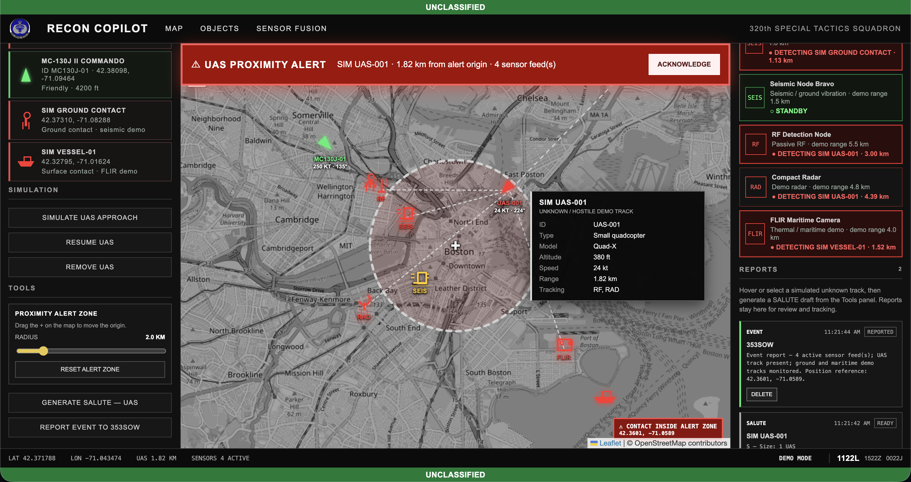
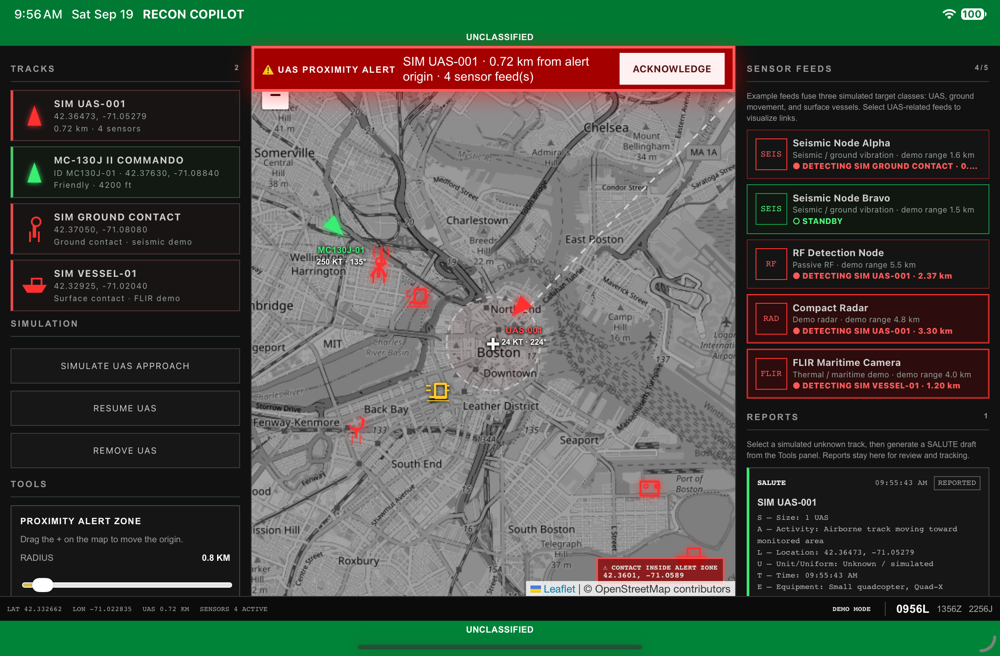
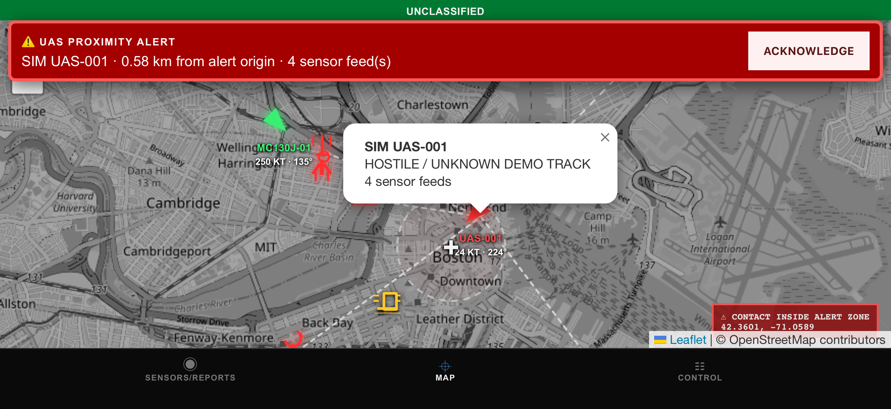
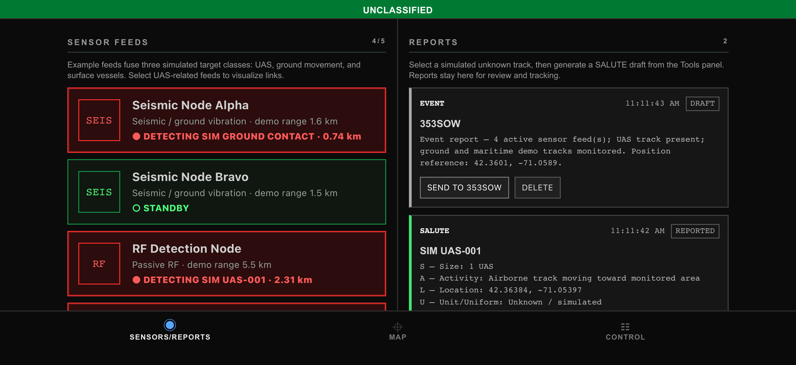

# RECON COPILOT

RECON COPILOT is a simulated situational-awareness mapping MVP with separate web, iPadOS, and iPhone interface builds.

> **Demo / prototype only.** Tracks, sensor detections, ranges, reports, imagery, personnel estimates, and other operational data in this repository are simulated examples and are not intended for operational use.

## Builds

| Directory | Version | Intended form factor |
| --- | --- | --- |
| `web/` | v9.0 | Desktop web browser |
| `ipad/` | v2.4.1 | iPadOS |
| `iphone/` | v2.5.3 | iPhone landscape |

The three directories are intentionally preserved as separate snapshots so the known-good form-factor-specific versions remain easy to run and compare.

## Web

```bash
cd web
npm install
npm run dev
```

For a production build:

```bash
npm run build
```

## iPadOS

```bash
cd ipad
npm install
npm run build
npx cap add ios      # first setup only, if ios/ does not exist
npx cap sync ios
npx cap open ios
```

Select an iPad simulator in Xcode and run the `App` target.

## iPhone

```bash
cd iphone
npm install
npm run build
npx cap add ios      # first setup only, if ios/ does not exist
npx cap sync ios
npx cap open ios
```

Select an iPhone simulator in Xcode. The phone UI is designed for landscape orientation and uses the `SENSORS/REPORTS`, `MAP`, and `CONTROL` views.

## Location permission on iOS

The mobile builds use device location for the proximity-alert origin. In the Xcode `App` target, ensure the app has a **Privacy - Location When In Use Usage Description** (`NSLocationWhenInUseUsageDescription`), for example:

> RECON COPILOT uses your location to place the proximity alert origin.

For Simulator testing, choose a simulated location from the Simulator's location controls.

## Repository size

Generated dependencies and build artifacts are deliberately excluded. In particular, do not commit `node_modules/`, `dist/`, Xcode `DerivedData/`, CocoaPods output, or user-specific Xcode state. Running `npm install` reconstructs JavaScript dependencies from `package.json` (and a lockfile when present).

## Project direction

A future cleanup can consolidate the three snapshots into one shared React/TypeScript/Capacitor codebase with responsive desktop, iPad, and iPhone layouts. Keeping the snapshots separate for now makes it easier to preserve the current working interfaces while that refactor is planned.

## Demo Screenshots

### Web



### iPadOS



### iPhone

#### Map



#### Sensors & Reports




